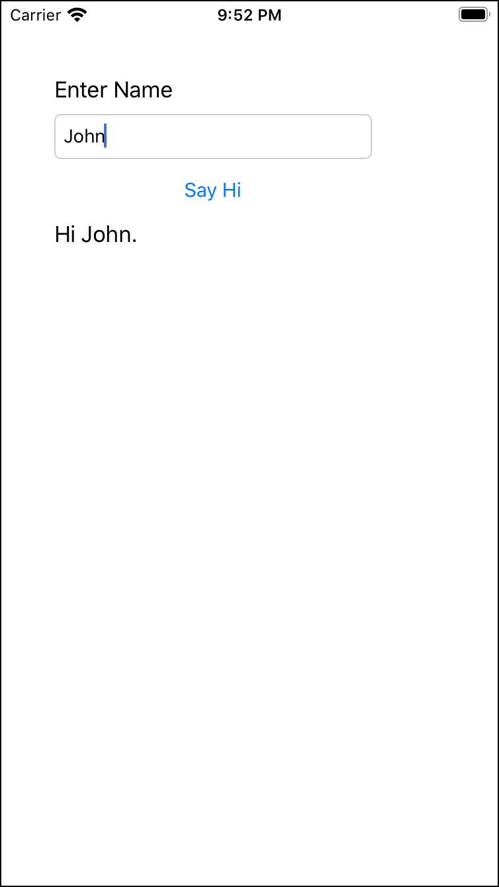

# App Dev Club Fall 2020

This repository contains the code for any projects I taught during the Fall 2020 semester with NCSU's app development club.

## iOS Meetings

### [Meeting 1 (8/25/2020)](./TestApp)

Simple intro / demo app. Asks user's name and the display's hello message. Used as an intro to Xcode and the workflow for iOS app development.

